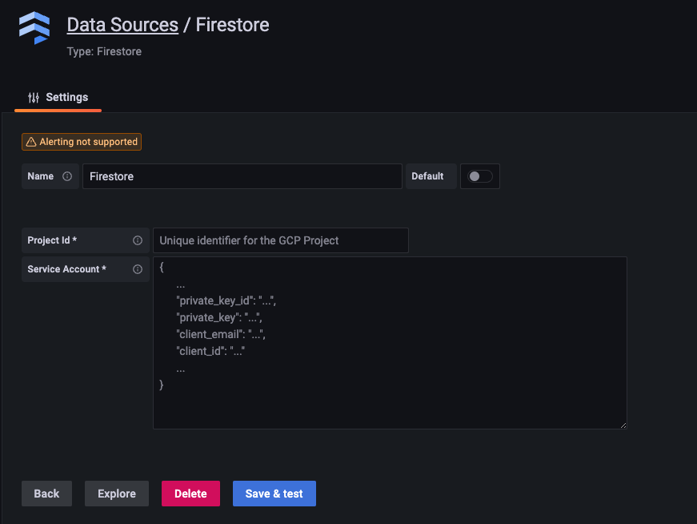
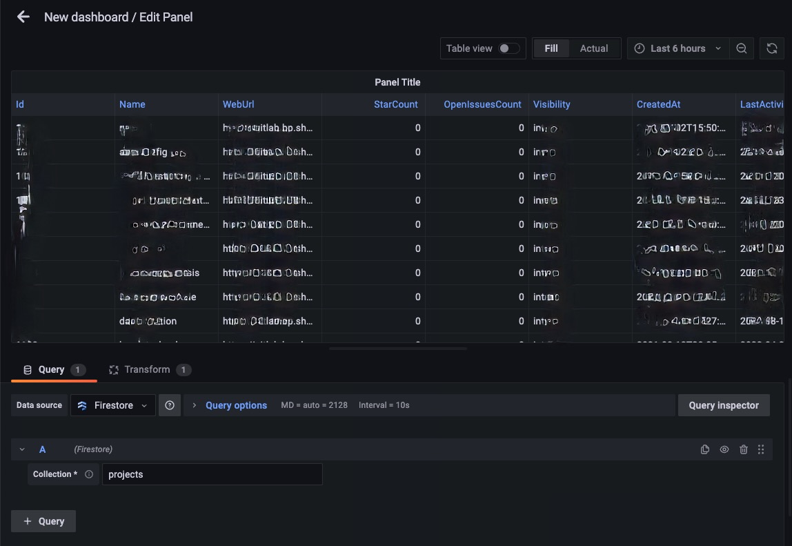

[](https://github.com/pgollangi/firestore-grafana-datasource/actions/workflows/ci.yml)
[](https://github.com/pgollangi/firestore-grafana-datasource/actions/workflows/release.yml)
# firestore-grafana-datasource

[Google Firestore](https://cloud.google.com/firestore) Data Source Plugin for [Grafana](https://grafana.com/).

Grafana Firestore Data Source Plugin enables integrating data on Firestore into Grafana dashboards.

It uses [FireQL](https://github.com/pgollangi/FireQL) to capture user query that translated to issue queries on Firestore and construct results.

> [FireQL](https://github.com/pgollangi/FireQL) is a Go library to query Google Firestore database using SQL syntax.


## Features
- [x] Use Google Firestore as a data source for Grafana dashboards
- [x] Configure Firestore data source with GCP `Project Id` and [`Service Account`](https://cloud.google.com/firestore/docs/security/iam) for authentication
- [x] Store `Service Account` data source configuration in Grafana encrypted storage [Secure JSON Data](https://grafana.com/docs/grafana/latest/developers/plugins/add-authentication-for-data-source-plugins/#encrypt-data-source-configuration)
- [x] Query Firestore [collections](https://firebase.google.com/docs/firestore/data-model#collections) and path to collections
- [x] Auto detect data types: `string`, `number`, `boolean`, `json`, `time.Time`
- [x] Query selected fields from the collection
- [x] Order query results
- [x] Limit query results
- [x] Query [Collection Groups](https://firebase.blog/posts/2019/06/understanding-collection-group-queries)
- [ ] Count query results
- [ ] Use of [Grafafa global variables](https://grafana.com/docs/grafana/latest/dashboards/variables/add-template-variables/#global-variables) in queries.

### Firestore data source configuration



### Using datasource 


## Getting started

### Frontend

1. Install dependencies

   ```bash
   yarn install
   ```

2. Build plugin in development mode or run in watch mode

   ```bash
   yarn dev

   # or

   yarn watch
   ```

3. Build plugin in production mode

   ```bash
   yarn build
   ```

4. Run the tests (using Jest)

   ```bash
   # Runs the tests and watches for changes
   yarn test
   
   # Exists after running all the tests
   yarn lint:ci
   ```

5. Spin up a Grafana instance and run the plugin inside it (using Docker)

   ```bash
   yarn server
   ```

6. Run the E2E tests (using Cypress)

   ```bash
   # Spin up a Grafana instance first that we tests against 
   yarn server
   
   # Start the tests
   yarn e2e
   ```

7. Run the linter

   ```bash
   yarn lint
   
   # or

   yarn lint:fix
   ```

### Backend

1. Update [Grafana plugin SDK for Go](https://grafana.com/docs/grafana/latest/developers/plugins/backend/grafana-plugin-sdk-for-go/) dependency to the latest minor version:

   ```bash
   go get -u github.com/grafana/grafana-plugin-sdk-go
   go mod tidy
   ```

2. Build backend plugin binaries for Linux, Windows and Darwin:

   ```bash
   mage -v
   ```

3. List all available Mage targets for additional commands:

   ```bash
   mage -l
   ```

#### Push a version tag

To trigger the workflow we need to push a version tag to github. This can be achieved with the following steps:

1. Run `npm version <major|minor|patch>`
2. Run `git push origin main --follow-tags`


## Contributing
Thanks for considering contributing to this project!

Please read the [Contributions](CONTRIBUTING.md) and [Code of conduct](CODE_OF_CONDUCT.md). 

Feel free to open an issue or submit a pull request!

## License

[MIT](LICENSE)
